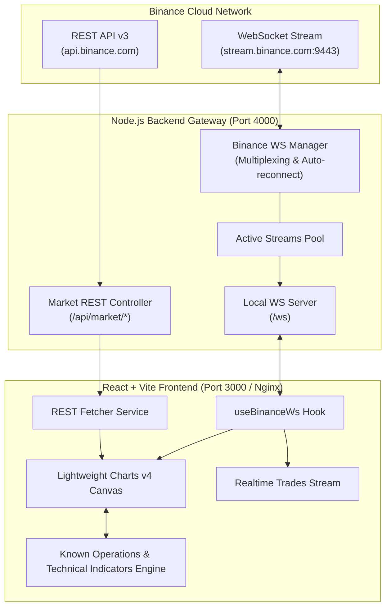

# Reporte de Arquitectura Técnica: Cliente Web & Gateway Proxy Binance

## 1. Visión General de la Arquitectura

El sistema implementa una arquitectura desacoplada y orientada a eventos para el streaming y visualización de datos bursátiles en tiempo real provenientes de Binance.



---

## 2. Decisiones de Diseño Clave

### 2.1 Carga Híbrida de Datos
- **Problema:** Los WebSockets de Binance solo transmiten el estado presente y futuro; no contienen el historial previo de velas necesario para dibujar gráficos ni calcular indicadores técnicos extensos (SMA 50, EMA 21, RSI 14).
- **Solución:** Al cargar la app o conmutar de par/temporalidad, el cliente solicita inmediatamente las últimas 500 velas vía REST (`GET /api/market/klines`). Simultáneamente, establece la suscripción WebSocket. Cuando llega el primer evento en vivo, este actualiza la última vela en memoria si coincide en tiempo (`time === lastBar.time`) o añade una nueva vela si el intervalo cerró (`isClosed === true`).

### 2.2 Multiplexación de Sockets en Backend
- En lugar de que cada cliente web abra una conexión directa hacia los servidores de Binance (lo que podría saturar límites de IP y conexiones concurrentes), el backend actúa como un **Proxy Gateway**.
- Si 100 clientes locales observan `ETHUSDT 1m`, el backend mantiene una **única conexión abierta** hacia Binance (`ethusdt@kline_1m`) y replica los mensajes a los 100 clientes suscritos mediante su propio servidor WebSocket local.

### 2.3 Cálculo de Indicadores y Detección de Operaciones Conocidas
- El módulo `frontend/src/utils/indicators.ts` procesa de forma eficiente en cliente los algoritmos matemáticos:
  - **SMA / EMA:** Cálculo incremental para superposiciones de tendencias rápidas y lentas.
  - **RSI (14 períodos):** Oscilador acotado [0, 100] para identificar sobrecompra (>70) y sobreventa (<30).
  - **Bandas de Bollinger (20, 2):** Media móvil central con bandas superior e inferior basadas en desviación estándar.
  - **Detección de Señales:** Detecta eventos clásicos del trading:
    - *Golden Cross:* Cruce alcista de EMA rápida sobre lenta (señal BUY con flecha verde debajo de la vela).
    - *Death Cross:* Cruce bajista de EMA rápida bajo lenta (señal SELL con flecha roja encima de la vela).
    - *RSI Reversals:* Rebotes desde zonas de sobreventa hacia la media.

---

## 3. Contrato de Mensajería WebSocket

### Del Cliente al Backend:
```json
{
  "action": "SUBSCRIBE",
  "symbol": "ETHUSDT",
  "interval": "1m"
}
```

### Del Backend al Cliente (Klines):
```json
{
  "type": "KLINE",
  "symbol": "ETHUSDT",
  "data": {
    "interval": "1m",
    "time": 1789275240,
    "open": 2519.85,
    "high": 2519.86,
    "low": 2519.84,
    "close": 2519.85,
    "volume": 41.0026,
    "isClosed": true
  },
  "timestamp": 1789275240123
}
```

### Del Backend al Cliente (Trades):
```json
{
  "type": "TRADE",
  "symbol": "ETHUSDT",
  "data": {
    "id": 4351724800,
    "price": 2519.85,
    "amount": 0.452,
    "time": 1789275240,
    "isBuyerMaker": false
  },
  "timestamp": 1789275240150
}
```

---

## 4. Estrategia de Contenerización y Despliegue

- **Backend:** Imagen Node Alpine multi-stage que compila TypeScript a JavaScript nativo y elimina dependencias de desarrollo (`--prod`).
- **Frontend:** Multi-stage build que genera el bundle de producción de Vite (`dist/`) y lo sirve con **Nginx Alpine**, configurado con compresión Gzip y proxy reverso hacia el contenedor backend para evitar problemas de CORS y puertos expuestos innecesarios.
