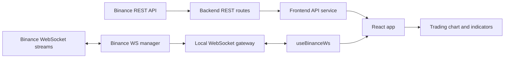

# Architecture

## Scope

The application has two deployable services:

- The frontend is a React 18 and Vite application served by Nginx.
- The backend is an Express application that proxies Binance REST and WebSocket data.

The backend is the only service that connects to Binance. The frontend calls the backend through REST and a local WebSocket endpoint.

## Runtime flow

## Data loading

When the selected symbol or interval changes, the frontend requests up to 500 historical klines and the symbol's 24-hour ticker statistics. It also reconnects to `/ws` and sends a `SUBSCRIBE` message.

The backend creates or reuses Binance subscriptions. It broadcasts matching kline and trade events only to local clients that subscribed to the same symbol and interval. The frontend merges live klines into its in-memory history and keeps the latest 50 trades.

## Deployment

Docker Compose runs both services on the `bnb-network` bridge network:

- Backend: container port `4000`, published as `localhost:4000`.
- Frontend: Nginx container port `80`, published as `localhost:3000`.
- Nginx serves the Vite bundle and proxies `/api/` and `/ws` to the backend container.

## Boundaries

- Binance credentials are not required for the public market endpoints used by this project.
- The backend currently allows all CORS origins. Tighten this before exposing it outside a local or controlled deployment.
- Indicator calculations run in the browser over the loaded kline history; the backend does not calculate trading signals.